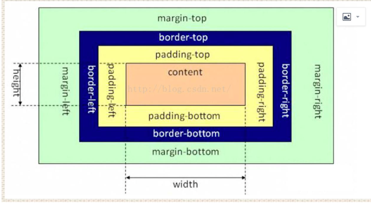
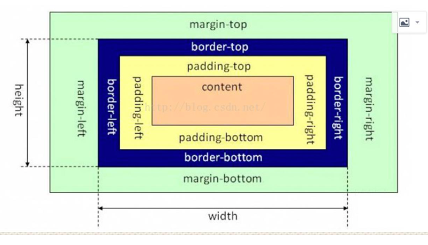

# css

## css 盒模型

- 用来装页面上的元素的矩形区域。
- CSS 中的盒子模型包括 IE 盒子模型和标准的 W3C 盒子模型。
- box-sizing 包含: border-box,padding-box,content-box.

### 标准盒子模型: content-box



### IE 盒子模型: content-box + padding-box + border-box



在 CSS3 中引入了 box-sizing 属性，

- box-sizing:content-box; 表示标准的盒子模型，
- box-sizing:border-box; 表示的是 IE 盒子模型，
- box-sizing:padding-box; 这个属性值的宽度包含了左右 padding+width ；

也很好理解性记忆，包含什么，width 就从什么开始算起。

## transition 和 animation 的区别

Animation 和 transition 大部分属性是相同的，他们都是随时间改变元素的属性值，他们的主要区别是 transition 需要触发一个事件才能改变属性，而 animation 不需要触发任何事件的情况下才会随时间改变属性值，并且 transition 为 2 帧，从 from .... to，而 animation 可以一帧一帧的。

## Flex 布局

Flex 是 Flexible Box 的缩写，意为"弹性布局"，用来为盒状模型提供最大的灵活性。

布局的传统解决方案，基于盒状模型，依赖 display 属性 + position 属性 + float 属性。它 对于那些特殊布局非常不方便，比如，垂直居中就不容易实现。

简单的分为容器属性和元素属性

### 容器的属性

#### flex-direction:决定主轴的方向(即子 item 的排列方法)

```css
.box {
  flex-direction: row | row-reverse | column | column-reverse;
}
```

#### flex-wrap:决定换行规则

```css
.box {
  flex-wrap: nowrap | wrap | wrap-reverse;
}
```

#### flex-flow:属性是 flex-direction 属性和 flex-wrap 属性的简写形式，默认值为 row nowrap。

#### justify-content:对其方式，水平主轴对齐方式

```css
.box {
  justify-content: flex-start | flex-end | center | space-between | space-around;
}
```

#### align-items:对齐方式，竖直轴线方向

```css
.box {
  align-items: flex-start | flex-end | center | baseline | stretch;
}
```

#### align-content 属性定义了多根轴线的对齐方式。如果项目只有一根轴线，该属性不起作用。

```css
.box {
  align-content: flex-start | flex-end | center | space-between | space-around | stretch;
}
```

### 项目的属性(元素的属性)

#### order 属性:定义项目的排列顺序，顺序越小，排列越靠前，默认为 0

#### flex-grow 属性:定义项目的放大比例，即使存在空间，也不会放大

#### flex-shrink 属性:定义了项目的缩小比例，当空间不足的情况下会等比例的缩小，如果 定义个 item 的 flow-shrink 为 0，则为不缩小

#### flex-basis 属性:定义了在分配多余的空间，项目占据的空间。

#### flex:是 flex-grow 和 flex-shrink、flex-basis 的简写，默认值为 0 1 auto。

#### align-self:允许单个项目与其他项目不一样的对齐方式，可以覆盖 align-items，默认属性为 auto，表示继承父元素的 align-items

## 垂直居中的方法

### margin:auto 法

定位为上下左右为 0，margin:0 可以实现脱离文档流的居中.

```html
<style>
  div {
    position: relative;
    width: 400px;
    height: 400px;
    border: 1px solid #465468;
  }

  img {
    position: absolute;
    top: 0;
    right: 0;
    bottom: 0;
    left: 0;
    margin: auto;
  }
</style>
<div>
  <p>垂直居中</p>
</div>
```

### margin 负值法

```css
.container {
  position: relative;
  width: 500px;
  height: 400px;
  border: 2px solid #379;
}

.inner {
  position: absolute;
  top: 50%;
  left: 50%;
  width: 480px;
  height: 380px;
  background-color: #746;
}

.inner {
  margin-top: -190px; /*height 的一半*/
  margin-left: -240px; /*width 的一半*/
}

/*或者*/
.inner {
  /*transform: translateX(-50%);*/
  /*transform: translateY(-50%);*/
  transform: translate(-50%, -50%);
}
```

### table-cell

设置父元素的 display:table-cell,并且 vertical-align:middle，这样子元素可以实现垂直居中。

```css
div {
  display: table-cell;
  width: 300px;
  height: 300px;
  text-align: center;
  vertical-align: middle;
  border: 3px solid #555;
}

img {
  vertical-align: middle;
}
```

### 利用 flex

将父元素设置为 display:flex，并且设置 align-items:center;justify-content:center;

```css
div {
  display: flex;
  align-items: center;
  justify-content: center;
  width: 300px;
  height: 300px;
}
```

## 块元素和行元素

- 块元素:独占一行，并且有自动填满父元素，可以设置 margin 和 padding 以及高度和宽度
- 行元素:不会独占一行，width 和 height 会失效，并且在垂直方向的 padding 和 margin 会失效。

## 多行元素的文本省略号

要设置宽高

```css
.box {
  display: -webkit-box;
  overflow: hidden;
  -webkit-box-orient: vertical;
  -webkit-line-clamp: 3;
}
```

## visibility=hidden, opacity=0，display:none

- visibility=hidden，该元素隐藏起来了，但不会改变页面布局，但是不会触发该元素已经绑定的事件
- opacity=0，该元素隐藏起来了，但不会改变页面布局，并且，如果该元素已经绑定一些事件，如 click 事件，那么点击该区域，也能触发点击事件的
- display=none， 把元素隐藏起来，并且会改变页面布局，可以理解成在页面中把该元素删除掉一样。

## 什么是 BFC

BFC 也就是常说的块格式化上下文，这是一个独立的渲染区域，规定了内部如何布局， 并且这个区域的子元素不会影响到外面的元素，其中比较重要的布局规则有内部 box 垂直放置，计算 BFC 的高度的时候，浮动元素也参与计算，触发 BFC 的规则有根元素， 浮动元素，position 为 absolute 或 fixed 的元素，display 为 inline-block，table-cell， table-caption，flex，inline-flex，overflow 不为 visible 的元素
